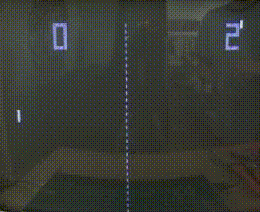
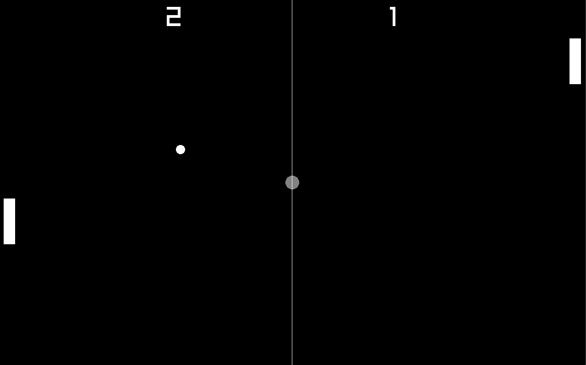
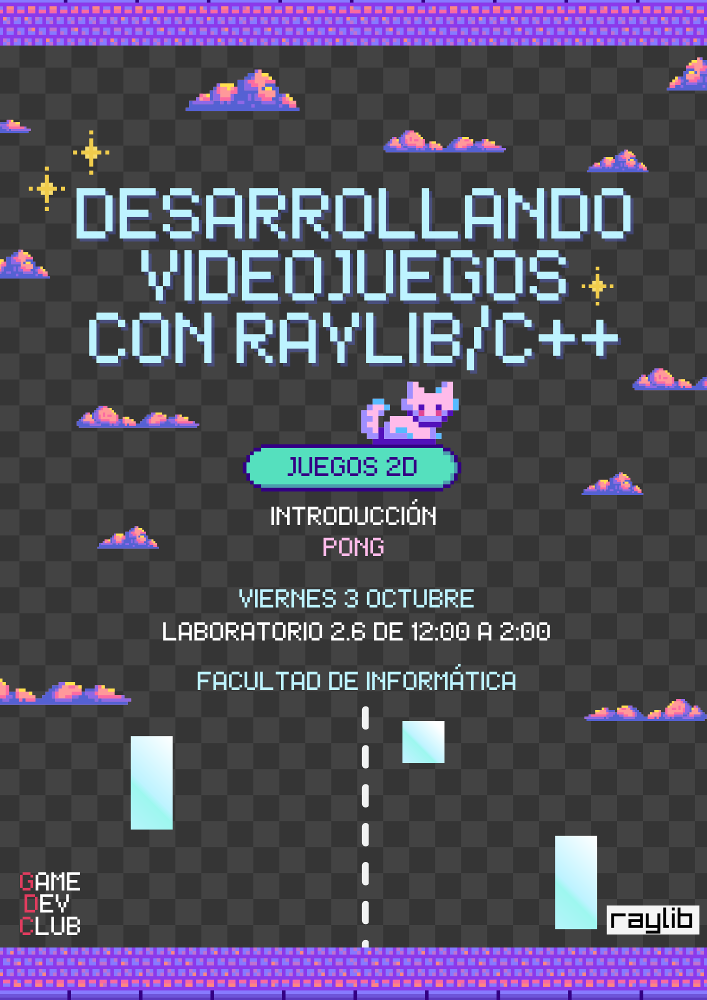

# Pong

*Izq. Original , Der. Recreado*

## El Juego Original

Pong fue desarrollador por Atari en 1972, fue uno de los primeros videojuegos comerciales. [Wiki](https://es.wikipedia.org/wiki/Pong)

## La Recreación

Es un juego con un diseño sencillo y fácil de recrear, por eso es un buen primer proyecto. Además es divertido jugarlo con otra persona.

Se pueden apender algunos temas fundamentales como dibujar elementos en pantalla, moverlos automáticamente, manejar la entrada de los jugadores y revisar colisiones entre formas básicas.

Se ha realizada en C++ usando Raylib, en unas 200 líneas de código.

---

### Poster Original del Evento

*Diseño del poster por Lucía.*