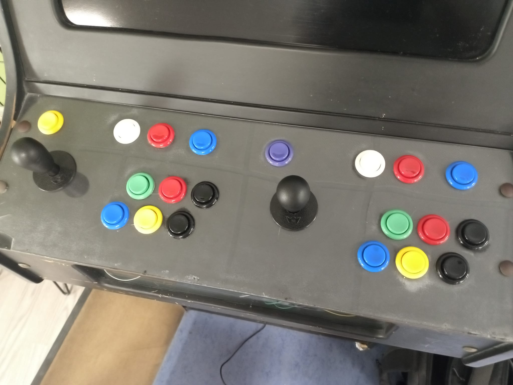

# Controles de la arcade

Los controles del sistema dependen del programa que se esté ejecutando.  
No tienen por qué ser los mismos.

Los controles del Player 1 están a la izquierda; los del Player 2, a la derecha. También existen dos botones generales.

A continucación, los controles según la interfaz por la que te desplaces:

## EmulationStation
La interfaz se controla con los controles del Player 1.

  Input          | Mando Arcade      | Teclado        |
:----------------|:------------------|:---------------|
**Player 1**     |                   |
[NORTH]          | Verde             | KEY M
[WEST]           | Azul              | KEY LEFT ALT
[EAST]           | Rojo              | KEY SPACE
[SOUTH]          | Amarillo          | KEY LEFT SHIFT
[START]          | Blanco            | KEY V
[SELECT]         | Rojo Superior     | KEY C
[D-PAD-UP]       | Palanca Arriba    | KEY UP
[D-PAD-DOWN]     | Palanca Abajo     | KEY DOWN
[D-PAD-LEFT]     | Palanca Izquierda | KEY LEFT
[D-PAD-RIGHT]    | Palanca Derecha   | KEY RIGHT
[LEFT-SHOULDER]  | Negro Superior    | KEY Z
[RIGHT-SHOULDER] | Negro Inferior    | KEY X
**General**      |                   |
[HOTKEY]         | Morado            | KEY 6

## RetroArch

Retroarch tiene una configuración global que se aplica a todos los emuladores compatibles (normalmente los emuladores que empiezan por `lr-`).

> Se encuentra en `/opt/retropie/configs/all/retroarch.cfg`.

También se puede crear una configuración específica para cierto emulador o un juego en concreto.
La estándar es la siguiente:

#### J1
La misma que en EmulationStation.

#### J2
  Input  | Botón          | Tecla          |
:-------|:----------------|:---------------|

#### GENERAL

